= HortonMachine for gvSIG plugins quickstart guide
for Version 0.2.0 and HortonMachine 0.8.2
:author: HydroloGIS S.r.l.
:date: 2017-03-02
:version: 0.2.0
:gvsig_version: 2.4.0
:hm_version: 0.9.0
:doctype: article
:encoding: utf-8
:lang: en
:toc: left
:numbered:
:icons: font
ifdef::backend-pdf[]
:title-logo-image: image::images/04_splash_hm.png[pdfwidth=4.25in,align=center]
:source-highlighter: rouge
//:rouge-style: github
//:source-highlighter: pygments
//:pygments-style: tango
endif::[]


This manual covers version {version} of the plugins, that are aligned with gvSIG {gvsig_version} and HortonMachine {hm_version}.

<<<<

== Introduction

The HortonMachine for gvSIG package contains a set of plugins for gvSIG that supply the following functionalities:

* <<spatialtoolbox,the HortonMachine Spatial Toolbox>>
* <<mapcalc,the Raster Mapcalculator>>
* <<epanet,the Epanet Plugins>>
* <<geopaparazzi,the Geopaparazzi Plugins>>
* a set of <<toolsutilities,tools and utilities>> we found to be usefull in our everyday life
* <<mapcontextmenu, some tools hidden in the context menu>>

== Installation

The plugins are supplied as a gvSIG package (**gvspks**) and can be downloaded from the https://github.com/TheHortonMachine/hydrologis4gvsig/releases[releases page].

Once downloaded, fire up gvSIG, enter the **Addons manager**, which can be found in the **Tools** menu, and choose the _Installation from file_ option. Browse for the downloaded installation package and you should end up with something similar to <<addons_hm>>.

[[addons_hm, Figure 1]]
.The addons manager wizard.


By pushing next you will be taken to the dialog that lists all installed and available plugins. Look for the plugins that start with **org.hortonmachine.gvsig** and select the latest available version (see <<addons_hm_selected>>)

[[addons_hm_selected, Figure 2]]
.The packages to install.
image::images/02_addons_manager.png[]

The wizard will list the plugins to install and prompt the user if he wants to continue. After that the installation will occurr and after it the user is prompted to restart gvSIG.

If everything went well, the splash screen should look like:

.The splash screen containing the HortonMachine icon.


And gvSIG should present a new menu entry named **HMachine**:

.The JGTools menu.
image::images/05_hm_menu.png[]

anchor:spatialtoolbox[]

== The HortonMachine Spatial Toolbox

The spatial toolbox is a simple user interface to access all the modules contained in the HortonMachine library.

image::images/toolbox.png[]

It is beyond this documentation to explain the toolbox. Have a look at this https://www.slideshare.net/moovida/new-tools-for-lidar-forestry-river-management-and-hydrogeomorphology-in-gvsig[presentation about the LiDAR and forestry related modules]. They also introduce the spatial toolbox.


anchor:mapcalc[]

== The Raster Mapcalculator

The mapcalc is a tool that can be use to perform map algebra on raster maps.

Let's assume you want to know which part of an elevation model between 1000 and 1300 meters looks towards south. 

Once you calculated the aspect map with the <<spatialtoolbox,Spatial Toolbox>>, you can use a mapalgebra formula like this:

[source,]
----
if (dtm_all>1000 && dtm_all<1300 && aspect >160 && aspect <200 ) {
    result = dtm_all;
} else {
    result = -9999.0;
}
----

The resulting map looks like:


anchor:epanet[]

== The Epanet Plugins

There is already some documentation about this plugin available. Please have a look at:

* https://www.slideshare.net/silli/epanet-in-gvsig[this presentation] given at the international gvSIG conference in 2015
* https://www.youtube.com/watch?v=NkMEqKKOlhA[this video] about data preparation in gvSIG
* https://www.youtube.com/watch?v=mjic69a-ArI[this video] about running an Epanet simulation

anchor:geopaparazzi[]

== The Geopaparazzi Plugins

=== Import a Geopaprazzi survey

gvSIG now has direct Geopaparazzi database support. That means that as you add any WMS, shapefile or tiff layer, now also an option for Geopaparazzi appears.

image::images/geopaparazzi_01.png[]

Once you select the database file, some information about the database will appear, as well as the layers it will create on loading:

image::images/geopaparazzi_02.png[scaledwidth=50%, width=50%, align="center"]

You have the option to import it to temporary layer, but also to create shapefiles from the database.  
The second option gives more features and is the suggested way to go.  

Once imported, the layers will be generated with their own default style and labeling:

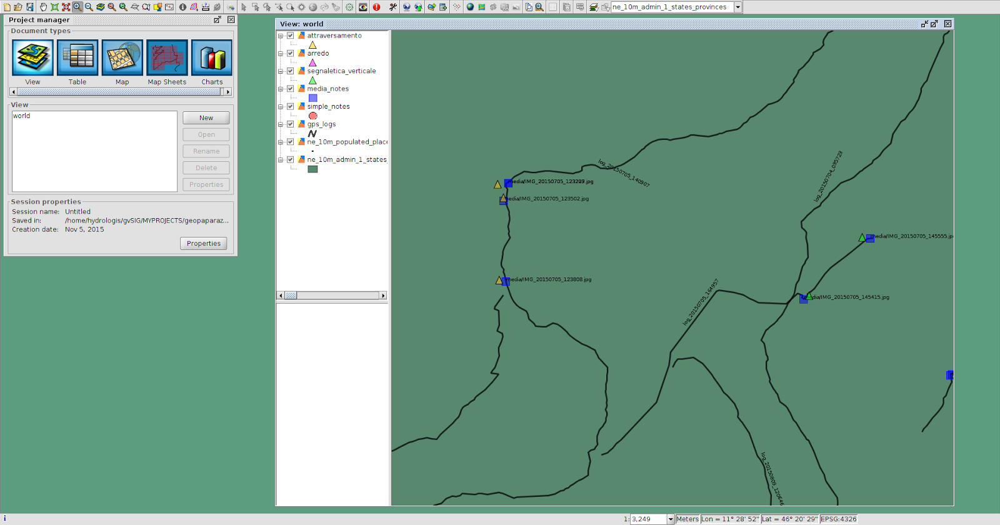

The media layer can now be queried with an own tool:

image::images/geopaparazzi_04.png[align="center"]

So if you select one or more images, they will be opened:


=== Prepare background data for geopaparazzi

gvSIG now also has the tool to create a tileset (for Geopaparazzi basemaps) from the current view:

image::images/geopaparazzi_06.png[]

One just needs to define the zoomlevels and the database name and output folder and run the tool.

=== The Geopaparazzi Project Browser and Simple Connection Server

WARNING: Unfortunately this tool didn't make it into this release due to some incompatibilities with the current gvSIG Nasa Worldwind plugin version. We are working on it, time permitting.

The following describes how it looks like in the HortonMachine standalone version.

The main panel openes up like the following:

image::images/gpserver_01.png[scaledwidth=70%, width=70%, align="center"]

With the button to the rigth of the top textfield, it is possible to browse to a folder, inside which all the geopaparazzi projects reside. Once set, the refresh button will trigger a project update:

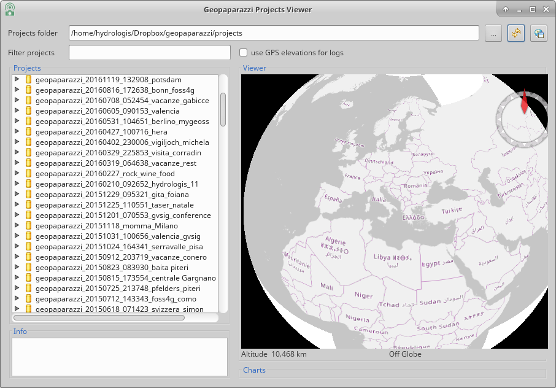

Each project can be expanded to show its content in terms of notes, logs and images. 

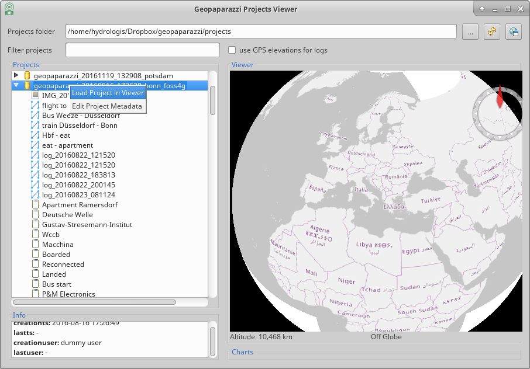

It is also possible to rigthclick and load the project in the 3D map view:

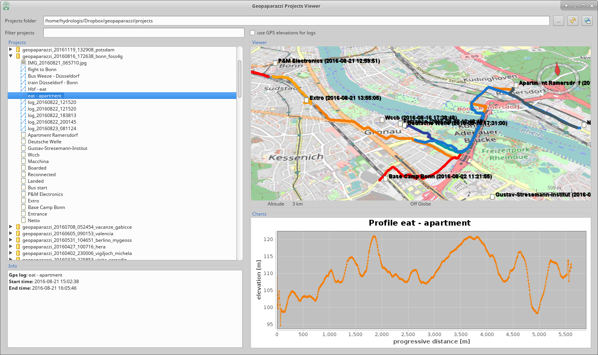

The logs are charted as a profile in the chart view and images can be opened or saved to disk directly:

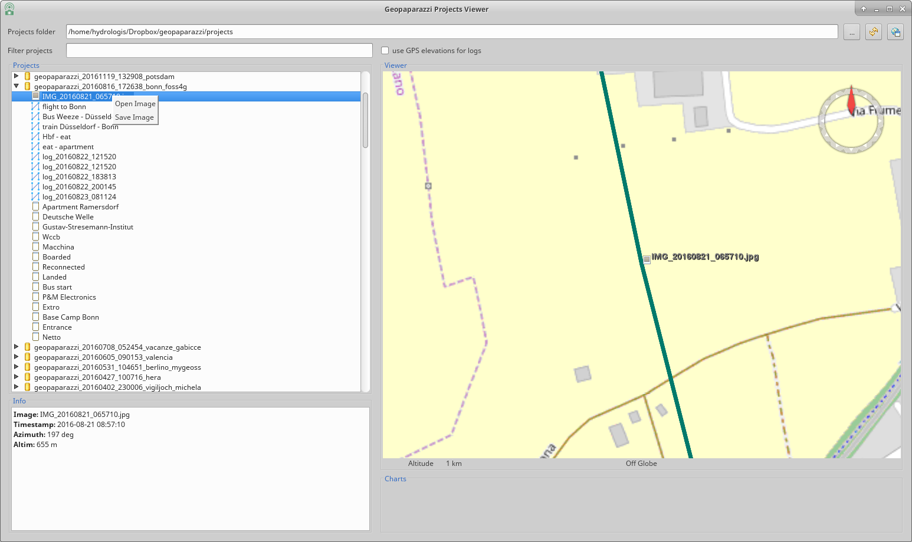

The most right button enables the server mode. Once pushed it askes for a port to use and then starts a server application that is listening to connections from geopaparazzi.

In geopaparazzi you need to enter 

```
Settings -> Cloud projects sync settings -> Server to connect to
```

and insert the ip address of your computer and the port used:

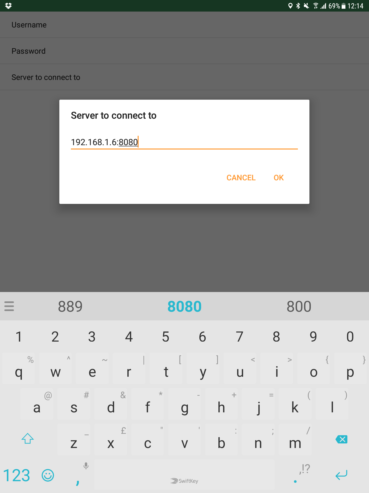

Once done, enter the import view and select **CLOUD PROJECT**. By doing so geopaparazzi will connect to the server and download the available projects list;

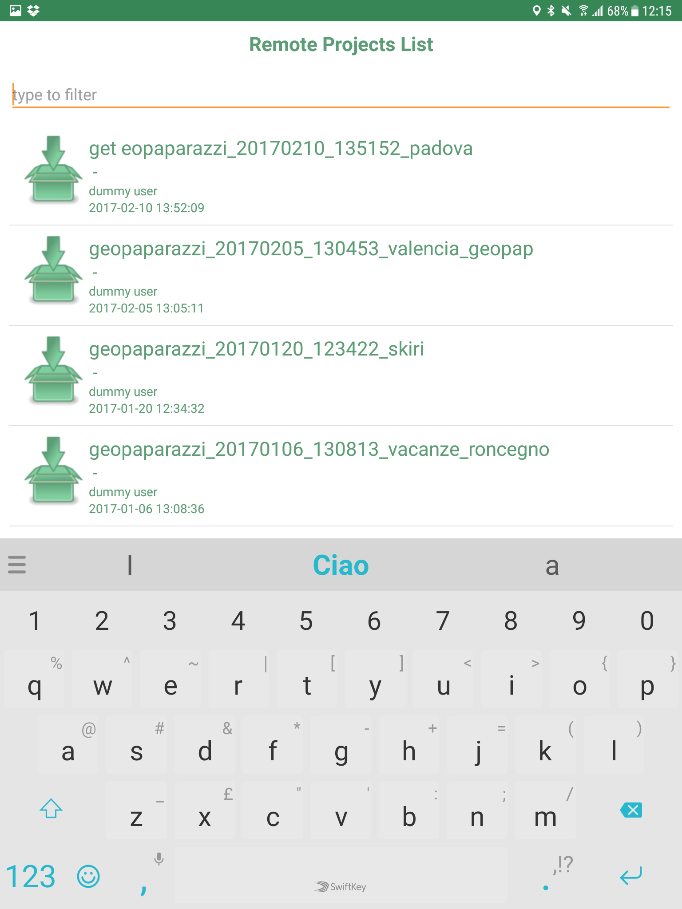

By pushing the download icon the project will be downloaded to the device, ready to be opened:

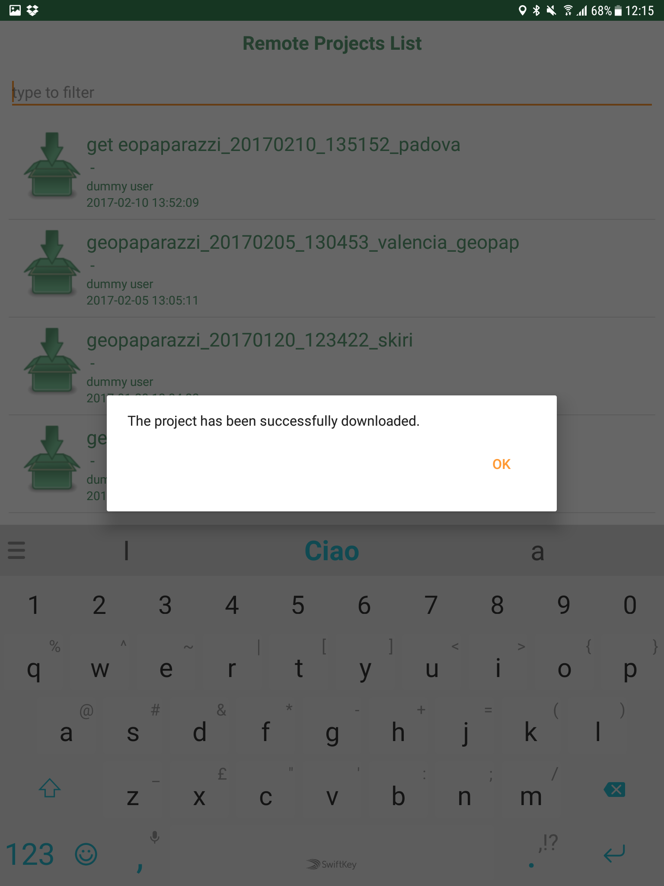

It is also possible to upload the current project to the server. Enter the EXPORT view and again select **CLOUD PROJECT**. 

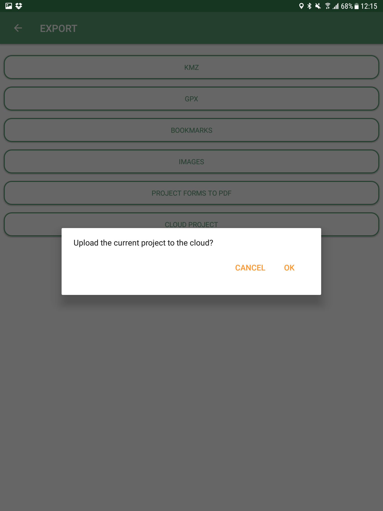

By doing so geopaparazzi will upload the current project database. Refreshing the projects viewer will make it appear in the list.


anchor:toolsutilities[]

== Tools & Utilities

The tools added by the plugins are the following:

image::images/tools.png[align="center"]

=== The Position Info Tool

This tools allows the user to view the clicked coordinates and see them in a different projection and also copies them into the clipboard:

image::images/infotool.png[]

=== WKT Geometry Tool

The Well Known Text toolbox it is a very simple tool, but we find it very useful:  

image::images/wkt_geom_tool_01.png[]

With it you can select a geometry in the layer and extract the WKT representation of the geometry.  

The same way, in the lower box, you can write/paste some WKT geometry and it will be inserted as new feature in the currently selected layer, if it is of the same geometry type. 

This makes it very easy, for example, to insert points in a layer.

=== The Projection tool

This simple tool allows the user to set the **prj** file for a file based layer.

image::images/prj_tool.png[]

One can select the layer and a projection. The projection can be customized in the textarea (maybe adding some missing Bursa Wolf Parameters).

Once apply is pushed this tool will do nothing more than create the prj file for the layer's source.

=== The Feature browser

The feature browser is a simple yet very usefull tool for the cases in which you need to control manually a whole set of data.

The tool puts the features in a list and allows the user to browse them back and forth. This assures that no feature has been left out.

Once the layer has been selected in the combobox, the first feature is selected and zoomed to:

image::images/featurebrowser_01.png[]

By using the navigation buttons it is possible to go to the next feature and check its information:

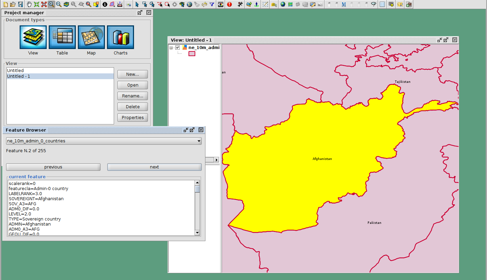


=== The raster styler

Right now, when one defines a colortable for a map, he gets 255 color rules.  
One good example is the https://en.wikipedia.org/wiki/Aspect_%28geography%29[map of aspect]. Such a map, that ranges between 0 and 360 degrees, is usually coloured from white to black between 0 and 180, and from black to white between 180 and 360. So all you need would be 3 rules, not 255 which make everything unreadable (apart of being wrong):  

image::images/raster_styler_02.png[]

One can access the raster styler also from the context menu obtained by right-clicking on a raster layer:


Just select the right colortable, set a bit of transparency and define the novalue (if necessary). Also set the number format pattern in the legend and push apply. That is it:

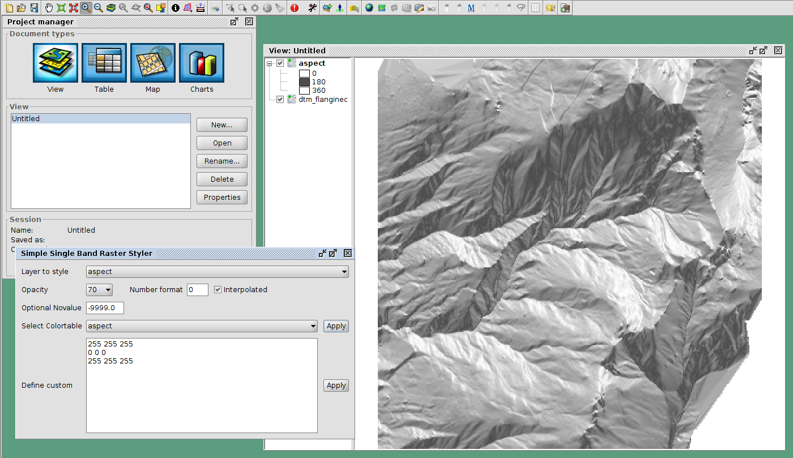

And if we add a nice elevation style to the DTM, that will look even nicer:


Some maps contain categories. An example is the map of flowdirection, which contains numbers between 1 and 9, but really contains the direction in which the water flows. In that case it is possible to add the category as a label in the legend:

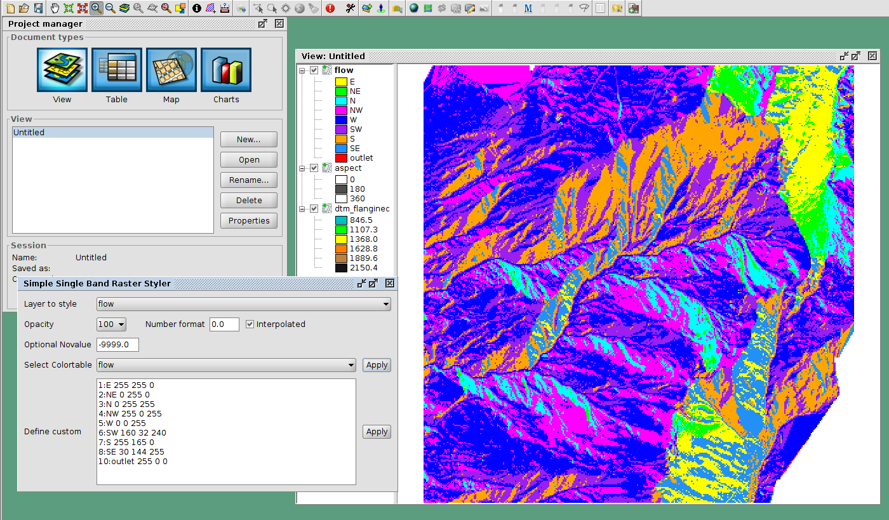

=== Raster Graphics View

We often need to analize small portions of large rasters a piece at the time. When you look at the region, due to the size of the raster, everything looks the same:

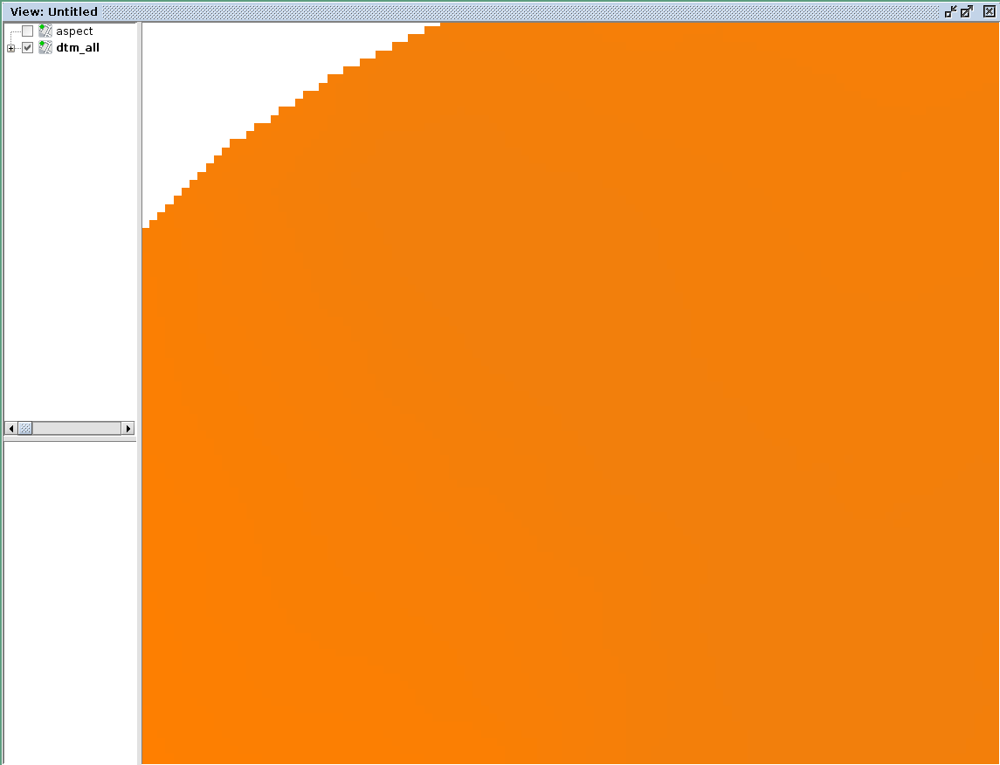

This is due to the fact that the colortable is calculated on the whole raster, while it would be convenient to have a local colortable.

image::images/graphics_view_00.png[scaledwidth=70%, width=70%, align="center"]

This is what the **Raster Graphics View** it here for. Once opened from the context menu of the selected raster, it openes a small window:

image::images/graphics_view_01.png[scaledwidth=70%, width=70%, align="center"]

Once selecting the options **show cells** and **no text**, it is possible to view the local colortable:

image::images/graphics_view_02.png[scaledwidth=70%, width=70%, align="center"]

It is also possible to view the raster values:

image::images/graphics_view_04.png[scaledwidth=70%, width=70%, align="center"]

or the cols/rows of the loaded raster file:

image::images/graphics_view_05.png[scaledwidth=70%, width=70%, align="center"]

or both:

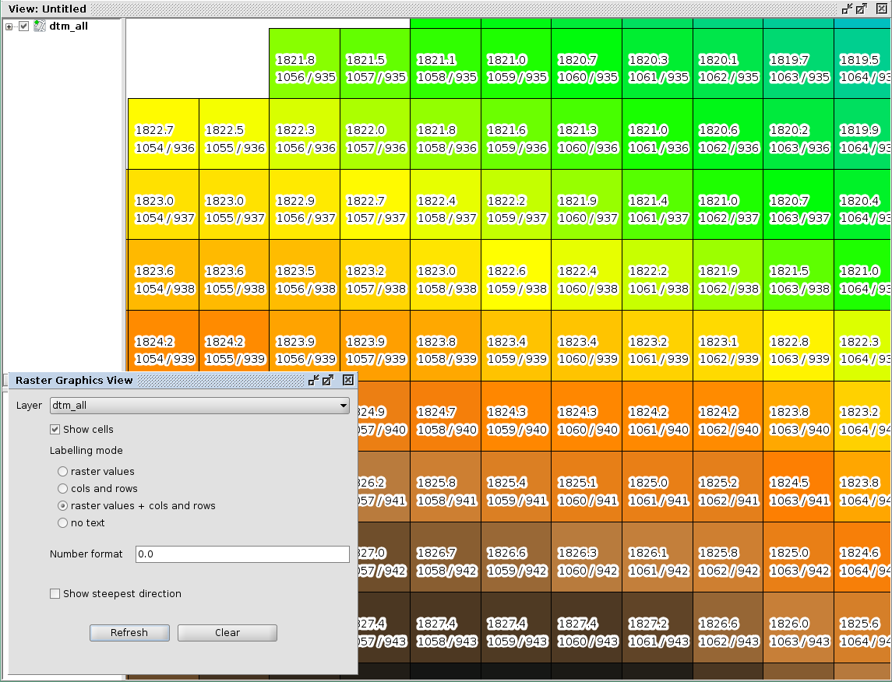

It is also possible to have a look at the steepest direction of each cell. This makes sense if the raster is an elevation model, in which case it will show a very simplified version of the flowdirections. But it is usefull to give an idea:

image::images/graphics_view_03.png[scaledwidth=70%, width=70%, align="center"]

In this case pits are shown as red fat dots.

The effect is better understood if we also overlay the map of aspect to have an idea of the morphology:

image::images/graphics_view_07.png[scaledwidth=70%, width=70%, align="center"]

=== Raster Values Copy

Have you ever needed to analyze small portions of large rasters? And maybe extract those portions to faster investigate them?

This is the tool you are looking for. It can be accessed from the context menu:

image::images/raster_values_copy_01.png[scaledwidth=70%, width=70%, align="center"]

Once triggered, it copies the visible portion of the map into the system clipboard as an ascii raster map, ready to be copied into a file and be used:

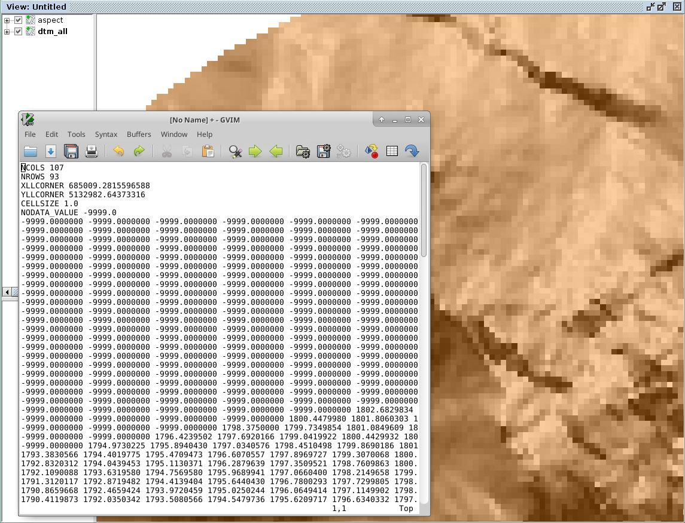

== Final remarks

These tools are brought to you by http://www.hydrologis.com[HydroloGIS S.r.l.] and most of their processing heart has been developed throughout the years by various research teams, the most important being the teams of:

* Professor http://abouthydrology.blogspot.it/[Rigon Riccardo] of the University of Trento, Faculty of Engineering
* Professor https://www.unibz.it/it/faculties/sciencetechnology/academic-staff/person/21255-giustino-tonon[Giustino Tonon] of the Free University of Bolzano, Faculty of Science and Technology

The source code of the gvSIG plugins is available at the project's https://github.com/TheHortonMachine/hydrologis4gvsig[github page]

If you have questions, depending on the type, please refer to the gvSIG https://listserv.gva.es/cgi-bin/mailman/listinfo/gvsig_internacional[users] or http://joinup.ec.europa.eu/mailman/listinfo/gvsig-desktop-devel[developers] list.
